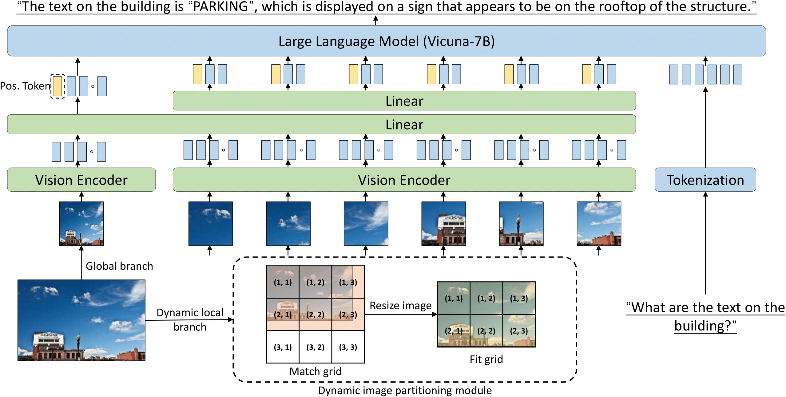

# AdaptVision

AdaptVsion: Dynamic Input Scaling in MLLMs for Versatile Scene Understanding

<a href="https://github.com/harrytea/AdaptVision"></a>

## Install 

Follow the installation of [LLaVA](https://github.com/haotian-liu/LLaVA?tab=readme-ov-file#install)

Clone [LLaVA](https://github.com/haotian-liu/LLaVA?tab=readme-ov-file#install) repository and navigate to LLaVA folder

```shell
git clone https://github.com/haotian-liu/LLaVA.git
cd LLaVA
Install Package
conda create -n llava python=3.10 -y
conda activate llava
pip install --upgrade pip  # enable PEP 660 support
pip install -e .
Install additional packages for training cases
pip install -e ".[train]"
pip install flash-attn --no-build-isolation
```

## Quick Start

Download the pretrained models and put it in checkpoints folder. [checkpoint baidu disk](https://pan.baidu.com/s/150qvBLL6n9U-qGThFCnpzg?pwd=zvwy)

```shell
python test.py \
    --LLaVA_model_path "/checkpoints/llava-7b-finetune" \
    --image_file "asset/tree.png" \
    --question "describe this image"
```

## Training data

The proposed Text-Grounding VQA 100K datasets can be downloaded from the following link

link1: [finetune_grounding_final.json](https://pan.baidu.com/s/17TfMMCWSqhQnKY4Jp360Rw?pwd=hz5r) 

link2: [grounding_finetune.zip](https://pan.baidu.com/s/1rtOYqcXGWGUEpVu4UVAsAA?pwd=w1g3)

Example

<div style="text-align:center;">
  <a></a>
</div>

```json
{
    "id": "example",
    "image": "example.jpg",
    "image_folder": "grounding_finetune",
    "conversations": [
        {
            "from": "human",
            "value": "<image>\nWhat is the displayed business\\'s name? Remember to mention the related text and its bounding box."
        },
        {
            "from": "gpt",
            "value": "The business name displayed is \"PARADISE PRE-OWNED, INC.\" with the corresponding bounding box being [0.062, 0.082, 0.932, 0.386]."
        },
        {
            "from": "human",
            "value": "Can you identify the location of this business? Please highlight the corresponding text and bounding box."
        },
        {
            "from": "gpt",
            "value": "The business operates at \"2608 New Butler Road, New Castle, PA 16101\". The text-related bounding box is [0.281, 0.646, 0.897, 0.757]."
        },
        {
            "from": "human",
            "value": "Is there a provided phone number for the business? If so, share the number and its bounding box."
        },
        {
            "from": "gpt",
            "value": "Yes, you can contact the business at \"724-656-0330\". The bounding box for this number is [0.253, 0.76, 0.93, 0.867]."
        }
    ]
}
```

You can download the other training data from [LLaVA](https://github.com/haotian-liu/LLaVA/tree/main), [LLaVAR](https://github.com/SALT-NLP/LLaVAR), and [Monkey](https://github.com/Yuliang-Liu/Monkey)


## Training

stage1: `bash scripts/pretrain.sh`

stage2: `bash scripts/finetune.sh`


## Acknowledgement

[LLAMA](https://github.com/meta-llama/llama), [LLaVA](https://github.com/haotian-liu/LLaVA), [LLaVAR](https://github.com/SALT-NLP/LLaVAR), [Monkey](https://github.com/Yuliang-Liu/Monkey)
